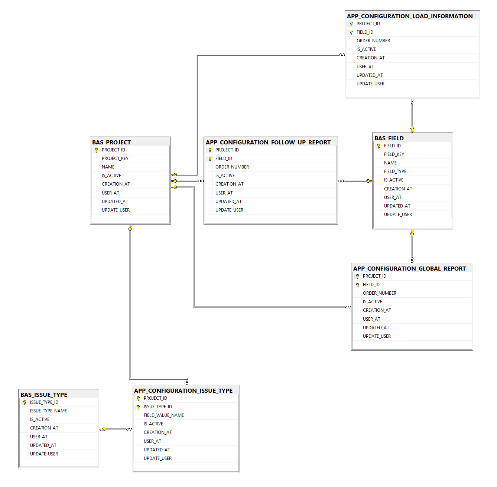
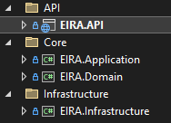
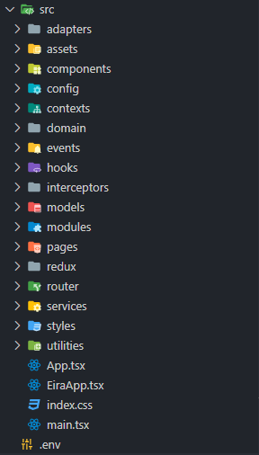
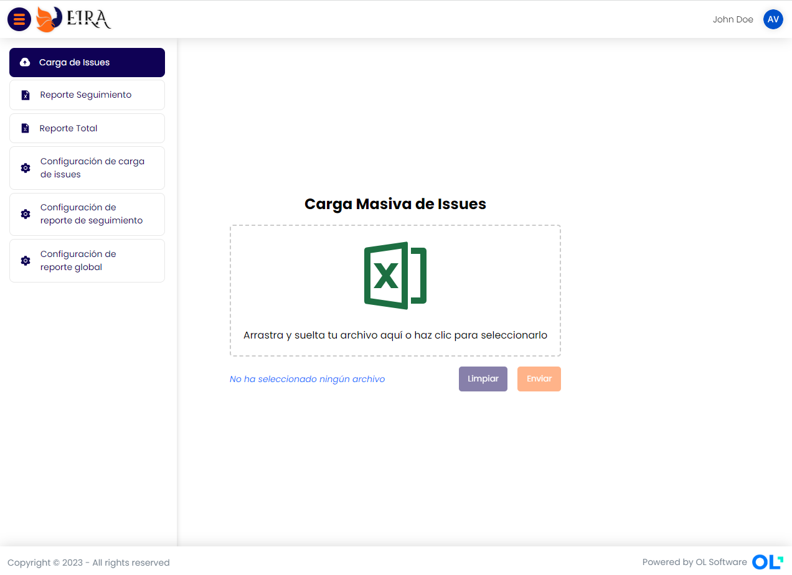
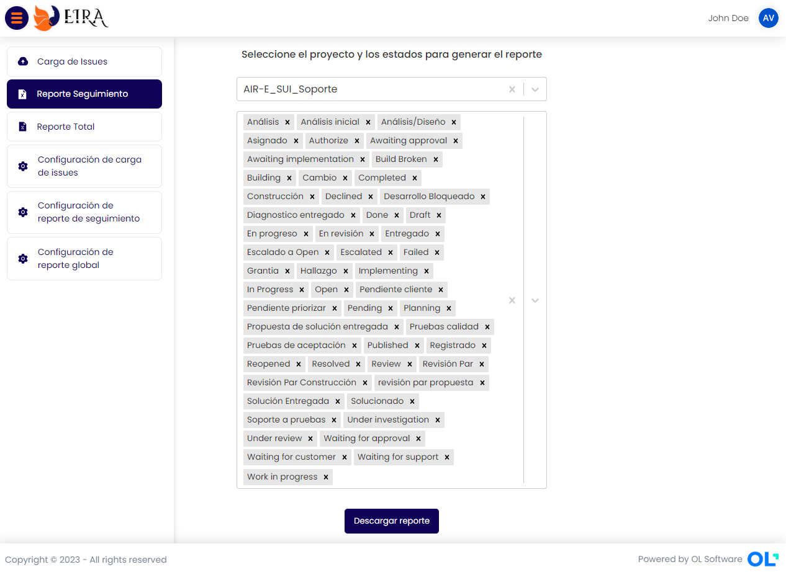
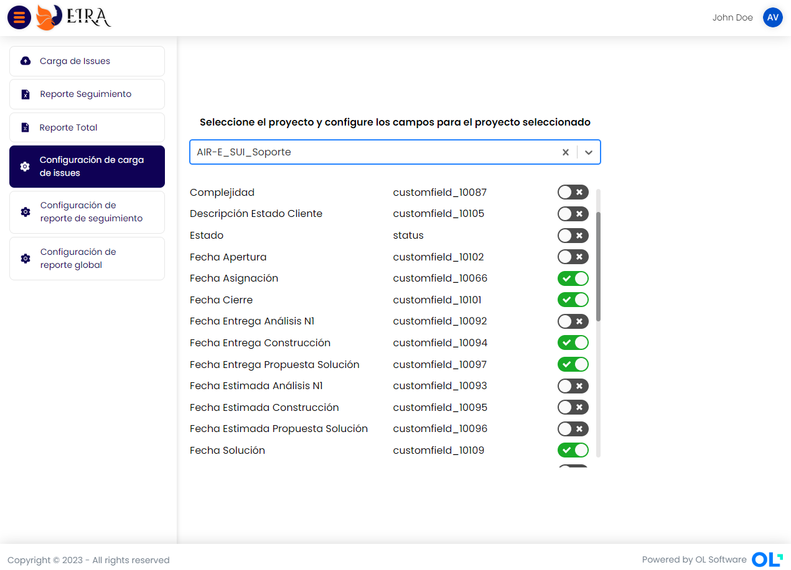

# **EIRA**


Aplicación de gestión de carga de incidentes y generación de reportes.

- ***Autor:*** *Alexis Córdoba*
- ***Email:*** *alexis.cordoba@olsoftware.com*


## ***Índice***
- [Documentación Técnica](#documentación-técnica)
- [Base de Datos](#base-de-datos)
- [Backend](#backend)
- [Frontend](#frontend)


## **Documentación Técnica:**

La aplicación permite tres funcionalidades de configuración, una funcionalidad de **Carga de incidentes** y dos funcionalidades para generar reportes.


- Configuración de carga de issues.
- Configuración de reporte de seguimiento.
- Configuración de reporte global.
- Carga de Issues.
- Reporte Seguimiento.
- Reporte Total.


## ***BASE DE DATOS***

Esta base de datos soporta las funcionalidades listadas en el apartado anterior. Alamacena las configuraciones de los reportes y la configuración de la carga de incidentes.

***Vista general del diagrama de entidad relacion (MER):***


- **Nombre:** *EIRA*
- **Versión del software del desarrollador:** *SQL Server Management Studio v18.12.1*
- **Nivel de compatibilidad:** *SQL Server 2016*

***Estos datos deben tenerse en cuanta al momento de hacer el despligue y que sea compatible***

## ***BACKEND***

API REST que cuenta que autenticación y los endpoints con las funcionalidades necesarias para soportar los requerimientos de carga de incidentes, reportes y sus configuraciones. Esta API, a su vez hace uso de un API externa que pertenece a JIRA/Atlassian, quienes han proveído y publicado estos recursos.

- **Lenguaje:** *C# 11*
- **Marco de trabajo:** *.NET 7*
- **Arquitectura:** *Limpia*
- **Sistema de autenticación:** *Bearer*


***Vista general de la arquitectura de la aplicación:***


- **Configuración adicional:** Esta configuración obedece al appsettings.json que hace parte del EIRA.API, que contiene la configuración de cadenas de conexión y algunas otras configuraciones adicionales:

| Llave | Valor | Ejemplo |
| ------------ | ------------ | ------------ |
| ConnectionStrings: defaultConnection      | Cadena de conección de la base de datos | "defaultConnection": "Data Source=(LocalDB)\\MSSQLLocalDB; database=EIRA; Trusted_Connection=True;" |
| ExternalAPIUrls: JiraAPIV3     | Punto público del API de JIRA en su versión 3      | "JiraAPIV3": "https://olsoftware.atlassian.net/rest/api/3" |
| EIRAApiKey | LLave para generar token      | "EIRAApiKey": "4lgun4_ll4v3_s3gur4_suf1c13nt3m3nt3_l4rg4"      |
| JiraConfiguration      | Sección para las configuraciones de JIRA      |      |
| Asignado     | Id de la cuenta de JIRA de la persona o cuenta que tendrá las issues asignadas por defecto      | "Asignado": "6229187f702bbb006a7f4fe" |
| ResponsableCustomFieldId | Número de identificación del campo que corresponse al responsable | "ResponsableCustomFieldId": "10065"|
| Gravedad | Diccionario de criterios de gravedad seleccionados por los funcionales para decidir cuál es la gravedad y obtener su identificación a través de la urgencia | 
```
"Gravedades": [
      {
        "Urgencias": [ "BAJA", "BAJO" ],
        "GravedadId": "10120"
      },
      {
        "Urgencias": [ "MEDIA", " MEDIO" ],
        "GravedadId": "10119"
      },
      {
        "Urgencias": [ "ALTA", "ALTO" ],
        "GravedadId": "10118"
      },
      {
        "Urgencias": [ "CRITICA", "CRITICO" ],
        "GravedadId": "10117"
      }
    ]

```    
***Estos datos deben tenerse en cuanta al momento de hacer el despligue y que sea compatible***


## ***FRONTEND***

Módulo de frontend que consume el API Rest publicada por el Backend.

- **Librería:** *React v18.2.0*
- **Lenguaje:** *TypeScript v4.9.3*
- **Versión de NODE:** *v18.14.2*
- **Arquitectura:** *Arquitectura limpia, modular y dependiente del framework*
- **Requiere autenticación:** *Sí*



Configuración de variables de entorno:

La única variable de entorno configurada a la fecha (13/06/2023) es la siguiente:
- **VITE_EIRA_API_URL:** Variable que contiene la url del api con la versión (hasta la fecha v1).

Esta variable debe configurarse en el archivo **.env**

```
// Ejemplo
VITE_EIRA_API_URL = https://endpointapieira/api/v1
```

***Estos datos deben tenerse en cuanta al momento de hacer el despligue y que sea compatible***


***Vista general de la aplicación:***






