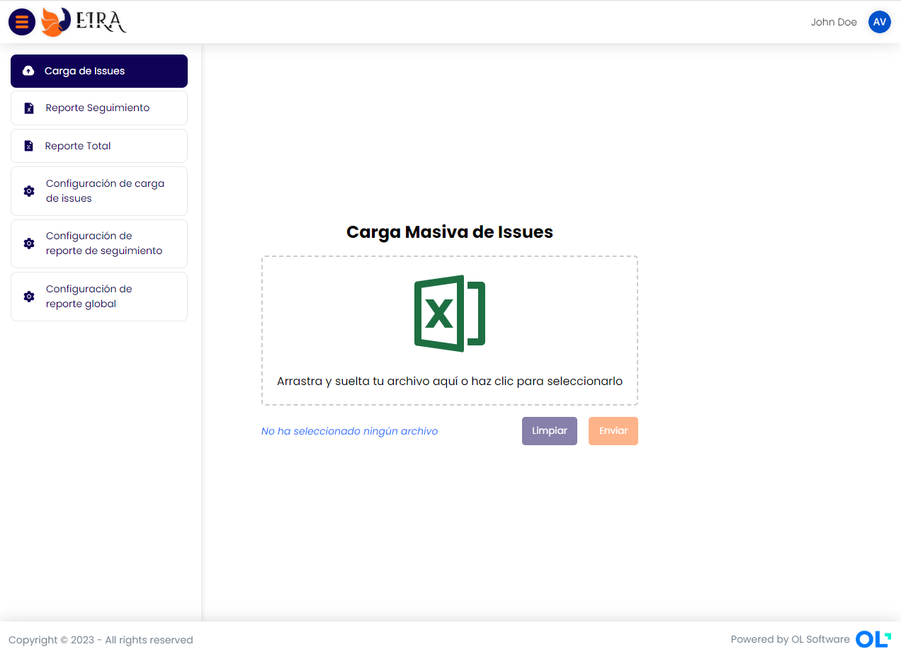
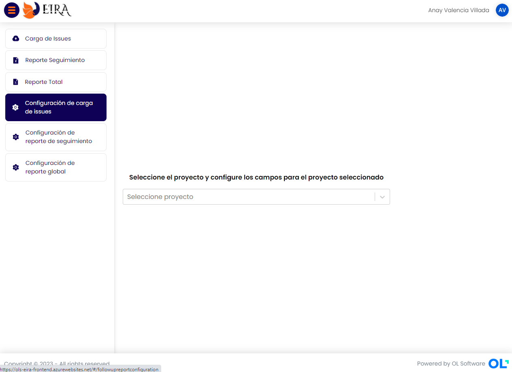

# **EIRA**


Aplicación de gestión de carga de incidentes y generación de reportes.

- ***Autor:*** *Alexis Córdoba*
- ***Email:*** *alexis.cordoba@olsoftware.com*


Índice:
- [Manual de Usuario](#manual-de-usuario)
- [Creación de token de acceso](#creación-de-token-de-acceso)
- [Configuración previa de proyecto](#configuración-previa-de-proyecto)
- [Autenticación](#autenticación)
- [Carga de Issues](#carga-de-issues)
- [Reporte Seguimiento](#reporte-de-seguimiento)
- [Reporte Global](#reporte-global)
- [Configuración de carga de issues](#configuración-de-carga-de-issues)
- [Configuración de reporte de seguimiento](#configuración-de-reporte-de-seguimiento)
- [Configuración de reporte global](#configuración-de-reporte-global)
- [Cerrar sesión](#cerrar-sesión)


## **Manual de Usuario:**

Este manual comprende las configuraciónes que deben hacerse desde el portal de JIRA y dentro de la aplicación para su funcionamiento.
Para la manipulación de la aplicación debe contar con una cuenta en el portal de JIRA y se deben hacer las siguientes configuraciónes dentro del portal de JIRA.

## **Creación de token de acceso:**

1. Ingresar a la URL: https://id.atlassian.com/manage-profile/security/api-tokens

2. **Click** en ***Crear token de API*** y se muestra un cuadro de diálogo en donde se debe poner un nombre al token y damos clic en **Crear**:


3. Se muestra un cuadro de diálogo con el valor del Token:


(***NOTA:*** Si el token aparece oculto, sólo activa el ojo en la caja de texto para alternar el modo de vista)
4. **Click** en el botón **Copiar**
5. Ese token es el valor de la contraseña que usará para ingresar a la aplicación ***EIRA***.
El token tiene un valor similar al siguiente:
```
ATATT3xFfGF0KkVtXa30eeqlUfubrdmjW300_iq7iClnOaOd5bgKDg97J9njS7AAb1j8w-nr_spp6668z7RElWgncJIBUM6NBGG-kTwQjjtGCqOtsYFNNWPo7ve5e7-OD7Ijce39xUxDyxhx55qY2s3hZGt20a1vd8x0DLkN6Nif8_dkmYq_g8I=0EE8F0C1
```

***NOTA:*** Si olvida el valor del token, sólo debe crear uno nuevo y revocar el anterior desde la lista de tokens.


## **Configuración previa de proyecto:** 

- En tanto el usuario desee ingresar a la aplicación y quiera interactuar con algún proyecto, el administrador del proyecto debe asignarle permisos al usuario.

- Debe configurar el flujo del **Tipo de Solicitud** en una tarea automatizada, de la siguiente manera:
1. En el portal de JIRA, ir a la lista de proyectos:


2. Seleccionar un proyecto de la lista.
3. En el panel izquierdo buscamos la opción **Configuración de proyecto**


4. Al cambiar el menú, buscamos la opción **Automation**:


5. Crear la regla automatizada.
6. Agregar sección.
7. Por coincidencia de Campo y seleccionar el campo **Tipo de incidente**.
8. Si el valor es igual a **___INCIDENTE___** (Cambiar por like)
9. Desactivar entregas de email.
10. Ingresar nombre: Iniciar con [API] Cambio de tipo de solicitud por tipo de incidente.
11. Aceptar regla.


## **Autenticación:**
1. Ingresa a la URL de EIRA: https://ols-eira-frontend.azurewebsites.net/

2. Ingrese su usuario (el mismo usuario que usa para ingresar a JIRA).
3. Ingrese el token obtenido en - [Creación de Token de Acceso](#creación-de-token-de-acceso)
Si las credenciales son correctas en unos instantes cargará la aplicación con las opciones en una barra lateral y su nombre en el lado derecha de la cabecera.



## **Carga de Issues**
En esta opción usted puede seleccionar o arrastrar el archivo de EXCEL que contiene la tabla con los issues que se desean cargar en JIRA.

***El proyecto debe estar previamente configurado para carga de issues***: Véase [Configuración de carga de issues](#configuración-de-carga-de-issues)

Para la identificación del tipo de issue, el nombre del archivo EXCEL debe iniciar con ***incidents*** o ***serviceCalls***.

1. Cargar o arrastrar el archivo.
2. **Click** en el botón **Enviar**

***Nota:*** En caso de querer cambiar de archivo puede hacer **Click** en el botón limpiar.

- **Consideraciones:** En caso de que al cargar el archivo algunas issues no se carguen, se generará un archivo con el log de errores con el siguiente formato:

- ***Proyecto:*** *Clave del proyecto.*
- ***Incidente:*** *El número de caso.*
- ***Issue:*** *El identificador de Issue en JIRA.*
- ***Error:*** *Descripción del error.*
- ***Operación:*** *Operación en la que saltó el error: Crear o Actualizar.*


*(Archivo de ejemplo, sin data real)*

## **Reporte de Seguimiento:**


En este reporte se excluyen los estados ***Cerrado*** y ***Anulado*** y le permite al usuario descartar otros en caso de que se requiera.

***El proyecto debe estar previamente configurado para generar este reporte***: Véase [Configuración de reporte de seguimiento](#configuración-de-reporte-de-seguimiento)

1. Para generar el reporte de seguimiento vamos a la barra lateral y damos **click** en la opción **Reporte seguimiento**.

2. Seleccionamos el proyecto y esperamos que carguen los estados disponibles.

3. Hacemos **click** en **Descargar reporte**.
4. Tendremos como salida un archivo similar al siguiente:
(***Nota:*** Los campos del archivo, dependen de la configuración del reporte en cada proyecto)

*(Archivo de ejemplo, sin data real)*


## **Reporte Global:**

En este reporte ***NO*** se excluye ningún estado.

***El proyecto debe estar previamente configurado para generar este reporte***: Véase [Configuración de reporte global](#configuración-de-reporte-global)

1. Para generar el reporte global vamos a la barra lateral y damos **click** en la opción **Reporte Global**.
2. Seleccionamos el proyecto.

3. Hacemos **click** en **Descargar reporte**.
4. Tendremos como salida un archivo similar al siguiente:
(***Nota:*** Los campos del archivo, dependen de la configuración del reporte en cada proyecto)

*(Archivo de ejemplo, sin data real)*


## **Configuración de carga de issues:**

En esta opción puede configurar los campos que va a usar en la carga masiva de issues correspondiente a la opción **Carga de Issues**:

1. **Click** en la opción **Configuración de carga de issues**.


2. Seleccionamos el proyecto y esperamos que carguen los campos disponibles dentro de la aplicación **EIRA**. Se muestra una tabla con tres columnas: Campo, Jira Id (Identificador del campo en JIRA) y Estado (si es verde está activo, de lo contrario está inactivo).


3. Para activar un campo simplemente vamos a la columna **Estado** y hacemos **click** en la celda. La aplicación hace la solicitud y cambiará su color (y su estado dentro de la configuración).

## **Configuración de reporte de seguimiento:**

En esta opción puede configurar los campos que va a usar en la generación del reporte en la opción **Reporte Seguimiento**:

1. **Click** en la opción **Configuración de reporte de seguimiento**.


2. Seleccionamos el proyecto y esperamos que carguen los campos disponibles dentro de la aplicación **EIRA**. Se muestra una tabla con cuatro columnas: Campo, Jira Id (Identificador del campo en JIRA), Orden (El orden de izquierda a derecha en el que se mostrarán en el reporte resultante) y  Estado (si es verde está activo, de lo contrario está inactivo).
En la siguiente imagen tenemos que el campo Comentarios tendrá la columna 9.


3. Activamos el campo a través de la celda en la columna estado.
4. El campo orden ingresamos el número de la columna que tendrá (por defecto será 1).
5. Repetimos por cada campo que necesitemos configurar en nuestro reporte.

## **Configuración de reporte global:**

En esta opción puede configurar los campos que va a usar en la generación del reporte en la opción **Reporte Global**:

1. **Click** en la opción **Configuración de reporte global**.


2. Seleccionamos el proyecto y esperamos que carguen los campos disponibles dentro de la aplicación **EIRA**. Se muestra una tabla con cuatro columnas: Campo, Jira Id (Identificador del campo en JIRA), Orden (El orden de izquierda a derecha en el que se mostrarán en el reporte resultante) y  Estado (si es verde está activo, de lo contrario está inactivo).
En la siguiente imagen tenemos que el campo Comentarios tendrá la columna 9.


3. Activamos el campo a través de la celda en la columna estado.
4. El campo orden ingresamos el número de la columna que tendrá (por defecto será 1).
5. Repetimos por cada campo que necesitemos configurar en nuestro reporte.


## **Cerrar sesión:**

Para cerrar sesión, hacemos **click** en el nombre o avatar que está en la cabecera y hacemos click en **Cerrar Sesión**.

Esto nos llevará de nuevo al inicio de sesión de la aplicación.